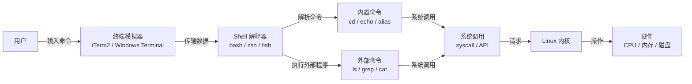
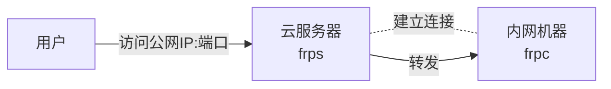
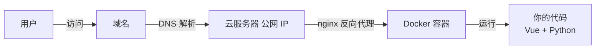

# 终端（Shell）与云服务器杂谈

## 一、终端与 Shell 基础

### 1.1 从输入到执行的整体流程



- **内置命令**：Shell 自身实现的命令（如 `cd`、`echo`），无需调用外部程序
- **外部命令**：独立的可执行文件（如 `ls`、`grep`），Shell 会通过 `fork + exec` 执行
- **系统调用**：所有命令（内置+外部）与内核沟通的桥梁（如 `read`、`write`、`open`）

### 1.2 终端（Terminal）

**起源**：终端最初是物理硬件设备（teletype，即"电传打字机"），用于人机交互。后来演变为软件模拟器。

**现在的终端软件**：

- macOS：Terminal.app、iTerm2、Hyper
- Windows：Windows Terminal、PowerShell、CMD
- Linux：GNOME Terminal、Konsole、Alacritty

**本质**：终端只是一个"界面"，负责接受输入、显示输出。它本身不解释命令。

### 1.3 Shell

**英文含义**：Shell（贝壳）—— 包裹在内核外层的软件

**定位**：Shell 是运行在用户态的命令解释器，负责：

- 读取用户输入的命令
- 解析命令
- 调用内核（通过系统调用）执行操作
- 返回结果给终端显示

**常见 Shell**：
| Shell | 简介 |
| ---------- | --------------------------------------------------------- |
| sh | 最早期 Unix 标准 Shell，简洁但功能少 |
| bash | Linux/Unix 最默认的 Shell，兼容性最好 |
| zsh | 插件生态丰富（oh-my-zsh），补全强大 |
| fish | 开箱即用，语法友好，不适合写脚本（但可以用 shebang 解决） |
| PowerShell | Windows 原生，强大对象管道 |

> **推荐**：macOS/Linux 用户日常使用首选 **zsh** 或 **fish**

### 1.4 查看与切换 Shell

```bash
# 查看当前使用的 Shell
echo $SHELL
# 或
ps -p $$

# 查看系统已安装的 Shell
cat /etc/shells

# 临时切换（仅当前会话有效）
zsh
fish
bash

# 设为默认 Shell（需要重启终端生效）
chsh -s /bin/zsh
```

> **小知识**：默认 Shell 是绑定到用户的，记录在 `/etc/passwd` 文件里。每个用户的最后一项就是她的默认 Shell。

### 1.5 交互式 vs 非交互式 Shell

| 类型           | 触发场景                                 | 读取的配置文件               |
| -------------- | ---------------------------------------- | ---------------------------- |
| 交互式 Shell   | 打开终端、SSH 登录、在终端输入命令       | `~/.bashrc`（或 `~/.zshrc`） |
| 非交互式 Shell | 执行脚本 `./script.sh`、`bash -c "命令"` | 通常不读取配置文件           |

> 简单理解：你在终端里手动敲命令 = 交互式；运行一个 .sh 脚本 = 非交互式

**常见问题**：为什么脚本里用不了 alias？

因为 alias 定义在 `~/.bashrc` 里（交互式才读取），而执行脚本是非交互式，不读取配置文件。所以脚本里用不了 alias。解决方法：

- 在脚本里手动定义 alias
- 或在脚本开头 `source ~/.bashrc` 加载配置

> 简单操作：全部放 `~/.bashrc` 就对了，懒人必备。

## 二、云服务器个人应用

### 2.1 云服务器的独特之处

**特性 1：有公网 IP**

- 任何地方都能访问到这台机器
- 可以搭建自己的服务：网站、博客、API、代理...

**特性 2：24 小时在线**

- 不关机、不断网，随时可用
- 可以跑定时任务、长期服务、守护进程...

> 结合这两个特性，我们可以做很多有趣的事情。

### 2.2 内网穿透：frp（Fast Reverse Proxy）

**frp 是什么**：一个反向代理工具，可以把内网服务暴露到公网。

**解决的问题**：

- 公司内网电脑想从家里访问？
- 开发测试的 Web 服务想让同事直接看？
- 家里 NAS 想在外网访问？

**工作原理**：



**组成**：

- `frps`（frp server）：运行在云服务器上，监听公网请求
- `frpc`（frp client）：运行在内网机器上，连接服务器并暴露服务

**应用场景**：

| 场景         | 做法                                        |
| ------------ | ------------------------------------------- |
| 远程办公     | 把公司内网开发机映射到公网，从家里 SSH 访问 |
| 演示 Demo    | 本地跑的服务直接给客户看，无需部署          |
| 调试 Webhook | 把本地 API 暴露给第三方回调测试             |
| 访问家宽服务 | 把家里 NAS/打印机映射到公网（注意安全）     |

**简单示例**：

```bash
# 云服务器（frps.ini）
[frps]
bind_port = 7000

# 内网机器（frpc.ini）
[common]
server_addr = your_server_ip
server_port = 7000

[ssh]
type = tcp
local_ip = 127.0.0.1
local_port = 22
remote_port = 6000
```

> 这样访问 `your_server_ip:6000` 就等于访问内网机器的 22 端口。

**frp vs nginx**：

> 上图中，frp 可以替换为 nginx 么？

| 特性       | frp                               | nginx                        |
| ---------- | --------------------------------- | ---------------------------- |
| 工作层级   | 传输层（TCP/UDP）                 | 应用层（HTTP/HTTPS）         |
| 用途       | 内网穿透                          | Web 服务器、反向代理         |
| 需要客户端 | 需要 frpc                         | 不需要                       |
| 支持协议   | 任意 TCP/UDP（SSH、数据库、 RDP） | 仅 HTTP/HTTPS                |
| 典型场景   | 把内网服务暴露到公网              | 负载均衡、SSL 终端、静态托管 |

> 简单理解：nginx 是"接电话的"（被动接收请求），frp 是"打电话的"（主动连接外网）。两者解决的问题不同。

**注意安全**：

- 别把端口暴露给陌生人
- 建议用 token 认证、限制端口访问

### 2.3 个人网站部署

**时代变了**：AI vibe coding + 廉价云服务器 = 人人都能拥有自己的网站

**成本**：

- 域名：~60¥/年（阿里云、腾讯云）
- 云服务器：~100¥/年（最廉价的那种）
- AI token：~40¥/月（MiniMax / GLM）

**个人案例**：我用 vibe coding 生成了一个全栈应用（Vue + Python + SQLite），一个人用完全够了。

**完整流程**：



**部署步骤**：

1. **买域名**：~60¥/年，选购后实名认证
2. **买云服务器**：选最便宜的，~100¥/年，建议选带 Docker 镜像的
3. **配置 DNS**：在云服务器控制台把域名解析到服务器公网 IP
4. **写代码**：让 AI 帮你写（"帮我写一个 todo list 应用，前端 Vue 后端 Python"）
5. **写部署文件**：让 AI 帮你写 Dockerfile 和 docker-compose.yml
6. **部署上线**：服务器上运行 `docker-compose up -d`
7. **备案**：在中国大陆的服务器需要 ICP 备案 + 公安备案

> 有了 AI，写代码和部署都不再是门槛。一个月 40 块 token 钱，就能拥有一个完全属于自己的网站。
