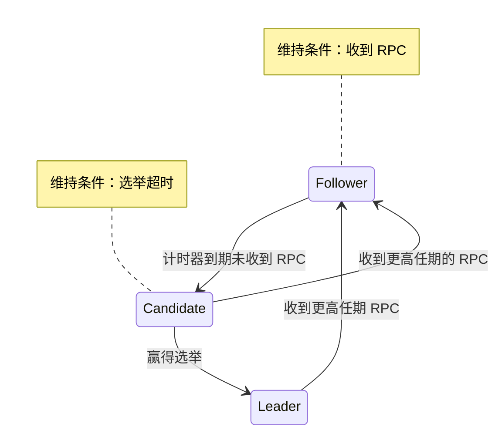

# 高可用与共识算法

介绍高可用相关概念，引申到共识算法，给出 MySQL 应用实例，最后简单介绍 CAP 定理、拜占庭问题与区块链共识算法。

## 高可用 High Availability, HA（介绍）

目标：最大化系统正常运行时间

过程（按时间）：

1. 故障前：故障一定会发生，要消除单点故障 ➡️ 冗余
2. 故障时：首先得知道故障了 ➡️ 检测，然后要处理故障 ➡️ 自动转移
3. 重大故障：转移不掉怎么办 ➡️ 从备份恢复
4. 没故障时：预防故障、零停机维护 ➡️ 负载均衡、弹性伸缩

组成：

- **冗**余：高可用的基础；计算、数据、网络、基础设施冗余
- 故障**检**测：发现问题；健康检查、性能监控、日志追踪
- 故障**转**移：反应机制；故障判定、流量切换、选主
- **备**份与恢复：冷（不运行）、温（不接流量）、热（随时准备）备份
- 负载**均**衡：分发流量、集成健康检查
- 自动化与**弹**性伸缩：CI/CD、k8s；自动扩容防止崩溃

**高可用 = 冗余 + 自动化（检测 + 决策 + 执行）**

## 集群模式（过渡）

高可用集群分类（按主节点个数）：**主备、双/多主**

- 主备模式，结构简单、资源利用率低，有什么风险？**脑裂**，出现两个大脑，不知道听谁的

- 双/多主模式，资源利用率高，但如何保证**一致性**？多个大脑意见不一，数据冲突

根本问题是，在**分布式**系统里多个节点上，如何做出一个**统一、可靠的决策**（谁当主节点、状态机操作接受 or 拒绝、操作顺序等）—— **共识**

## CFT 共识

如果让我们屋子里所有人达成一个共识，比如晚上吃什么？怎么做？—— “少数服从多数”

共识算法最简单、最核心的思想就是 “少数服从多数”，但如何定义多数并获得一个 可验证、同步协调、防篡改的多数是很复杂的

我们先考虑一个简单一些的场景 —— **非拜占庭场景（Crash Fault Tolerance, CFT）**

节点**可能宕机、网络延迟、丢包，但不会撒谎、不会伪造消息、不会恶意作恶**，这是现实系统中最常见、最实用的一类共识场景。在这个场景下，容忍 f 个错误的多数定义为 f +1，即总共需要 **2f + 1** 个节点

## CFT 共识算法 Consensus Algorithm（重点）

### Paxos —— 奠基之作

出处：**Leslie Lamport in《The Part-Time Parliament》**

目标：如何在一个不可靠的分布式系统（节点会宕机、网络会延迟、会丢包）中，让所有节点就某个值（例如，数据库的一条记录）达成一致？

创新：通过“提议-批准”的**两阶段**协议，即使有部分节点故障，也能就一个值达成共识，只要**多数派**节点存活

意义：被严格证明正确的分布式共识算法，奠定了整个领域的理论基础

局限：论文本身不好理解，而且描述并非单个可编码的算法；具体实现五花八门，业界难以统一

### Raft —— 业界标准

出处：**Diego Ongaro  and John Ousterhout in《In Search of an Understandable Consensus Algorithm》**

目标：设计一个**易于理解**的共识算法，提供与Paxos相同的容错和性能，但其正确性更易于验证，且更适合构建实际系统

创新：

- 问题分解为三个子问题
  - **领导者选举：** 集群如何选出唯一的主节点？
  - **日志复制：** 主节点如何将操作复制到从节点？
  - **安全性：** 如何保证状态机的绝对一致性（例如，不会提交不同位置的日志）？
- 强领导机制：Raft规定，**任何时候，系统都必须有一个明确的领导者**。所有客户端请求都必须经过领导者
- **清晰的状态转换：** 每个节点只有三种明确的状态：**Leader, Follower, Candidate**。状态转换逻辑清晰

意义：为可理解而设计并提供完整开源实现参考，显著降低门槛、推动生态繁荣，并现已成为非拜占庭常见下的首选共识算法（事实标准）

对比：在非拜占庭容错的场景下，与 Paxos 在功能与安全性上等价

应用：[Raft 开源地址](https://raft.github.io/)、ETCD、Docker Swarm ...

### Raft 算法实现

简要说明一下 Raft 的算法实现，我们聚焦于集群中的单个节点

一个任期，两个 RPC 与 三个身份：

| Role / RPC    | RequestVote RPC 请求投票              | AppendEntries RPC 追加条目                               |
| :------------ | :---------------------------------------- | :----------------------------------------------------------- |
| **Leader**    | ❌ | ⬆️ **核心工作** 定期主动发起，包含日志条目或仅心跳维持权威 |
| **Candidate** | ⬆️ **核心工作** 自增任期号后发起，并收集响应 | ⬇️ 若收到并且任期号不小于自己，则承认领导并退位为 Follower |
| **Follower**  | ⬇️ 重置选举计时器，决定是否投票（一期一票）、更新任期 | ⬇️ **核心工作** 重置选举计时器，检查日志 |

状态机：

留下一个问题：成员有变化怎么办？（答：联合共识，过渡阶段需要在新旧两组成员上达成共识）

## 以 MySQL 为例

MySQL 是一个有状态服务

有状态服务 ➡️ 状态机 + 操作日志

有状态服务集群 ➡️ 复制状态机 ➡️ 日志共识

强一致性 MySQL 集群，通过达成 **Binlog 共识**，保证一致性

当集群网络分区时，通过**共识算法**选出新主，多数分区有新主继续服务，少数分区无主停止服务

## 附：CAP 定理

一致性（Consistency）、可用性（Availability）、分区容错性（Partition tolerance）

当 **P**（网络分区）这个不可避免的情况发生时，你必须在 **C**（一致性）和 **A**（可用性）之间二选一

简单证明，两个对等数据库作为集群，当分区时：

- 若要求一致性则不可用（写入 A 无法，同时写入 B）

- 若要求可用性则不一致（A、B 写入不同数据，不一致）

扩展：PACELC 定理，进一步阐述了当 P 不发生的理想情况下，如何权衡延迟（Latency）与一致性

if P A or C, Else L or C

## 附：拜占庭将军问题与区块链共识算法 

**拜占庭将军问题 Byzantine Generals Problem**，它描述了一种分布式系统中的容错问题，即在一个不可靠的、可能存在叛徒（故障或恶意组件）的网络中，如何让所有忠诚的将军（正常工作的组件）就一个共同的行动计划达成一致。这个问题是区块链的核心问题之一。

解决这个问题需要 **拜占庭容错（Byzantine Fault Tolerance, BFT）**算法：

- **实用拜占庭容错 （Practical BFT, PBFT）** **N >= 3f +1** 可以容忍 f 个恶意节点

- 中本聪共识，也就是比特币使用的 **工作量证明（Prove of Work, PoW）** 可以容忍 **<50%** 算力的恶意节点
- ...
