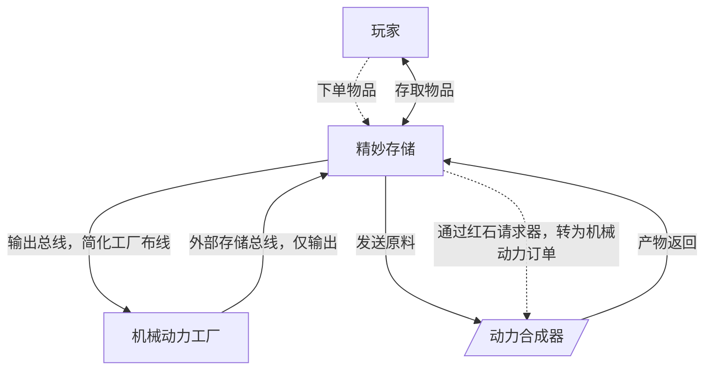
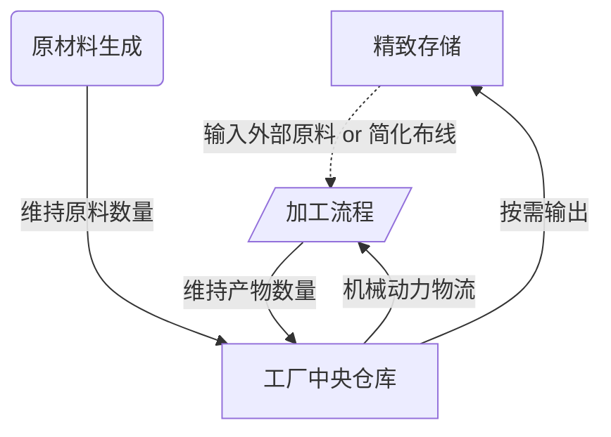
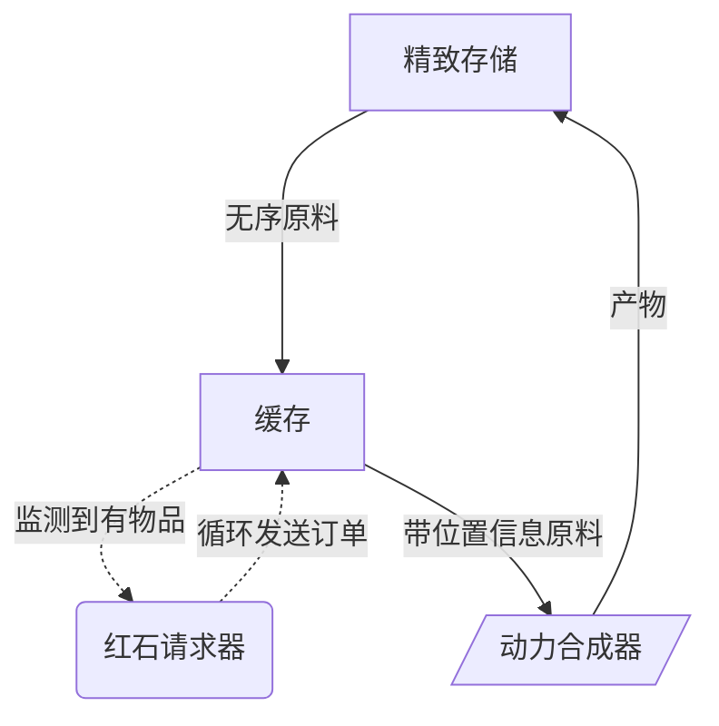

# 亡者世界科技规划

为 MC 整合包《亡者世界》设计的科技规划。

## 目标

1. 消耗品（药、弹药）自动化，维持一定数量方便取用
2. 合成自动化，RS 中一键下单获取产物
3. 所有产物可从 RS 获取，常用物品采用存储监控器方便取用

## 核心模块

- Refined Storage 精致存储
	- 核心存储网络 - 仓储量大
	- 自动合成
	- 人机交互界面
- Factory 机械动力工厂
	- 主动维持内部原料、中间产物和成品到设定数量
	- 通过工厂仪表，控制工厂加工流程
	- 存储空间相对有限，仅用作工厂内使用，不接受外部输入
	- 主要完成消耗品的自动化目标
- Mechanical Crafter 动力合成器
	- 用于 RS 自动合成中的动力合成配方
	- 每个配方需要一个缓存存储原料，和一个红石请求器来输出有效的机械动力订单
	- 动力合成器可以按需求添加更多并行执行

## 架构图

实线代表物流走向，虚线代表控制信号

## 关键流程

### RS - 工厂

忽略上图的虚线部分，可以发现工厂是一个独立的系统，用仅输出的存储总线接入 RS 的唯一目的是为了统一从 RS 交互。

虚线部分输入外部原料很好理解，简化布线是一个可选项：如果走机械动力物流太复杂，可以在加工流程的输入端直接使用 RS 的输出总线从 RS 获取原料，而这个原料实际上也可以是从工厂本身输入 RS 的！即从 仓库->加工 变为 仓库->RS->加工（这个变化大概率是不需要的，因为 6.0 的物流已经很便利了）。

### RS - 动力合成

不同于 AE，RS 的自动合成样板在输出原料给动力合成器时会丢失位置信息，因此我们不能直接将 RS 供应的原料直接输入合成器。

不同于常见的“占位符”解决方案，我的解决方案是相对简单但稍贵的红石请求器方案：

每个配方有自己的缓存&红石请求器，RS 将供应的原料输出到缓存后，循环激活请求器直到缓存清空。整个流程实际上是将 RS 的请求转化为了机械动力物流的订单。

对比占位符解决方案：

| 对比项  | 占位符方案                  | 请求器方案                 |
| ---- | ---------------------- | --------------------- |
| 复杂程度 | 复杂                     | 简单                    |
| 造价   | 单套昂贵（控制电路、机械臂等），但多配方通用 | 单套便宜，但扩展配方需要单独请求器     |
| 多配方  | 可以，设置新的带占位符样板即可        | 可以，添加新的样板和请求器即可       |
| 并发性  | 较难扩展（需要控制包裹顺序等）        | 可以，因为包裹隔离，轻松实现多配方混合并发 |
