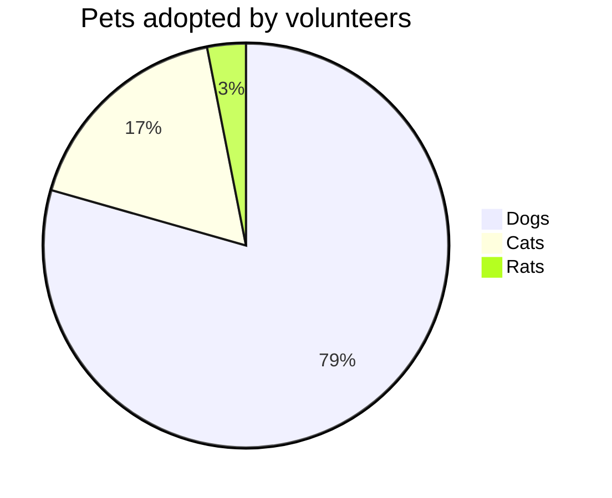
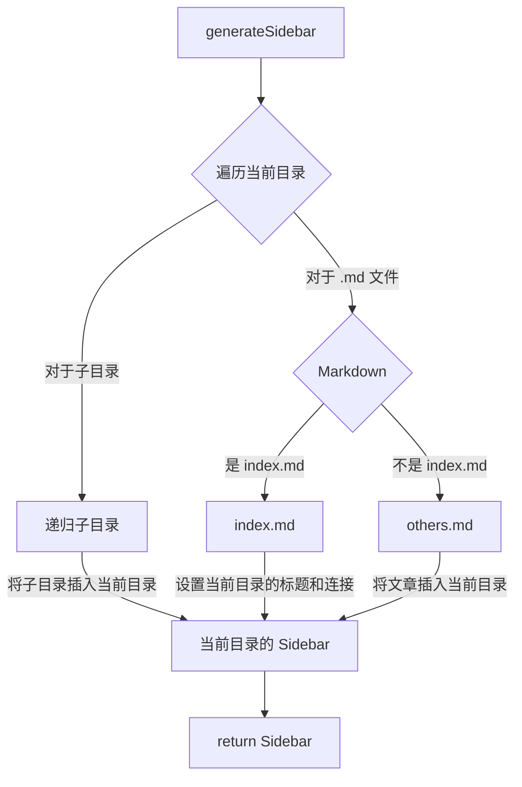

# 网站搭建

分享一下本网站的搭建流程与用到的技术等。

以后的网站功能更新等也会记录在这篇文章的[功能扩展](#功能扩展)部分中。

*本文不会细致入微的讲解每个细节，所以需要读者有一定基础。（如会用 github 创建仓库，拉取仓库到本地等）*

## 搭建

本网站基于 [Vitepress](https://vitepress.dev/) 构建。

> VitePress is a Static Site Generator (SSG) designed for building fast, content-centric websites. In a nutshell, VitePress takes your source content written in Markdown, applies a theme to it, and generates static HTML pages that can be easily deployed anywhere.

### 项目创建

1. 创建仓库

    首先打开 Github 随意创建一个空仓库，我选择的是使用 `<username>.github.io` 这个特殊仓库，当然使用其他仓库也没问题。

    需要注意的是，如果想用一个仓库就完成代码托管和部署，那这个仓库一定要是公开仓库，不能是私有仓库。*（可以使用一个私有仓库保存代码，一个公开仓库部署的方式，但我觉得没必要）*

2.  本地创建项目

    首先本地找个喜欢的目录，把仓库拉到本地：
   
    ```bash
    git clone REPOSITORY DIRNAME && cd DIRNAME # 替换大写变量！
    ```

    然后就是创建 Vitepress 项目的步骤了，可以参考[官方文档](https://vitepress.dev/guide/getting-started)，下面简要带过一下：

    1. 安装 Vitepress：

        ```bash
        npm add -D vitepress
        ```

    2. 使用 setup wizard 初始化项目：

        ```bash
        npx vitepress init
        ```

        运行后会有一些配置，按自己喜欢的选择就好。

        ::: details *我的配置，仅供参考：*
        ```
        ┌  Welcome to VitePress!
        │
        ◇  Where should VitePress initialize the config?
        │  ./
        │
        ◇  Site title:
        │  My Awesome Project
        │
        ◇  Site description:
        │  A VitePress Site
        │
        ◇  Theme:
        │  Default Theme + Customization
        │
        ◇  Use TypeScript for config and theme files?
        │  Yes
        │
        ◇  Add VitePress npm scripts to package.json?
        │  Yes
        │
        └  Done! Now run npm run docs:dev and start writing.

        Tips:
        - Since you've chosen to customize the theme, you should also explicitly install vue as a dev dependency.
        ```
        :::

    3. 如果用自定义主题的话要单独安装 `vue`：

        ```bash
        npm install vue -D
        ```

    4. 安装到这里就完成啦！运行下面的命令就可以查看预览了。

        ```bash
        vitrepress dev
        # or
        npm run docs:dev # 需要上面配置时选择创建 npm scripts
        ```

3. 推送代码
   
    项目创建完后第一件事当然是提交 initial commit 啦：

    ```bash
    git add *
    git commit -m "initial commit"
    git push
    ```

    这样代码就推送到 Github 上了，下面我们将简单配置本项目，让这个网站看起来更舒服一些。

### 初步配置

- 添加 `.gitignore`
  
    ```
    .vitepress/dist
    .vitepress/cache
    node_modules/
    .vscode/
    ```

- 整理文件结构
  
    vitepress 的[路由生成](https://vitepress.dev/guide/routing)是遵守实际的文件结构的。

    > VitePress uses file-based routing, which means the generated HTML pages are mapped from the directory structure of the source Markdown files.

    将创建项目生成的两个样例文件 `api-examples.md` 和 `markdown-examples.md` 放到一个 `examples` 文件夹中（也可以直接删掉）。

    此外，再新建一个 `articles` 文件夹用于存放之后写的文章。

    `index.md` 就留在根目录就好。

- 配置 `.vitepress` 文件夹下的配置文件 `config.mts`：

    TODO

## 部署

部署方面，代码存放在 Gihub。通过 `Github Page` 和 `Vercel` 两种方式进行部署。
最后在腾讯云购买域名解析到 Vercel 上解决国内访问的的问题。

### Github Page

配置过程

修改构建方式

### Vercel

配置过程

### 域名

购买与配置

## 使用指南

### 写文章

### 新电脑迁移

## 功能扩展 

### Vitepress 集成 Giscus

### Vitepress 集成 Mermaid

使用现成插件 [vitepress-plugin-mermaid](https://emersonbottero.github.io/vitepress-plugin-mermaid/)。

首先安装插件：

```bash
npm i vitepress-plugin-mermaid mermaid -D
```

然后编辑配置文件：

```typescript{18}
import { withMermaid } from 'vitepress-plugin-mermaid'

let config = defineConfig({
  ..., // 其他配置

  // optionally, you can pass MermaidConfig
  mermaid: {
    // refer for options:
    // https://mermaid.js.org/config/setup/modules/mermaidAPI.html#mermaidapi-configuration-defaults
  },
  // optionally set additional config for plugin itself with MermaidPluginConfig
  mermaidPlugin: {
    // set additional css class for mermaid container
    class: "mermaid"
  }
}

config = withMermaid(config)

export default config
```

然后就可以像在 Typora 里写 mermaid 一样了。


````markdown

````


### 腾讯云 COS 图床 + PicGo 上传

::: warning
使用 PicGo 上传图片之后，如果在本地(markdown 中)又删除了这张图片，那么 COS 中的图片不会随之删除。
这会造成 COS 存储空间的浪费，并带来额外费用。*（很少很少）* 
:::

### 自动生成 Sidebar

有些文章集合需要一个 Sidebar 来当目录（比如[50个前端练手项目](/articles/50projects50days/)）。

我通过一个 `generateSidebar` 函数来实现这个功能。原理图如下：



:::details 实现代码
```typescript
import { readdirSync, statSync } from 'fs'
import { join, parse } from 'path'
import matter from 'gray-matter'

import { DefaultTheme } from 'vitepress'
type SidebarItem = DefaultTheme.SidebarItem

function generateSidebar(dir: string) {
  // 初始化 SidebarItem
  let sidebar: SidebarItem = {
    base: `/${dir}/`,
    // text 初始值为目录名
    text: `${parse(dir).name}`,
    items: []
  }
  // 遍历目录
  let files = readdirSync(dir)
  let subDirs: string[] = []
  files.forEach((file) => {
    let path = join(dir, file)
    let stat = statSync(path)
    if (stat.isDirectory()) {
      // 稍后处理子文件夹
      subDirs.push(file)
    } else {
      // 处理 md 文件
      if (file.endsWith('.md')) {
        let { data } = matter.read(path)
        let { title } = data
        if (!title) {
          // frontmatter 中没有 title，就用文件名作为 title
          title = file.replace(/\.md$/, '')
        }
        if (file == 'index.md') {
          // 如果有 index 文件，就把它作为 Sidebar 的标题
          sidebar['text'] = title
          sidebar['link'] = file.replace(/\.md$/, '')
          return
        }
        // 一般不是 index 的文件，就作为 Sidebar 的子项
        let item: SidebarItem = {
          text: title,
          link: file.replace(/\.md$/, '')
        }
        sidebar.items!.push(item)
      }
    }
  })
  subDirs.forEach((subDir) => {
    let subSidebar = generateSidebar(join(dir, subDir))
    sidebar.items!.push(subSidebar)
  })
  return sidebar
}
```
:::
