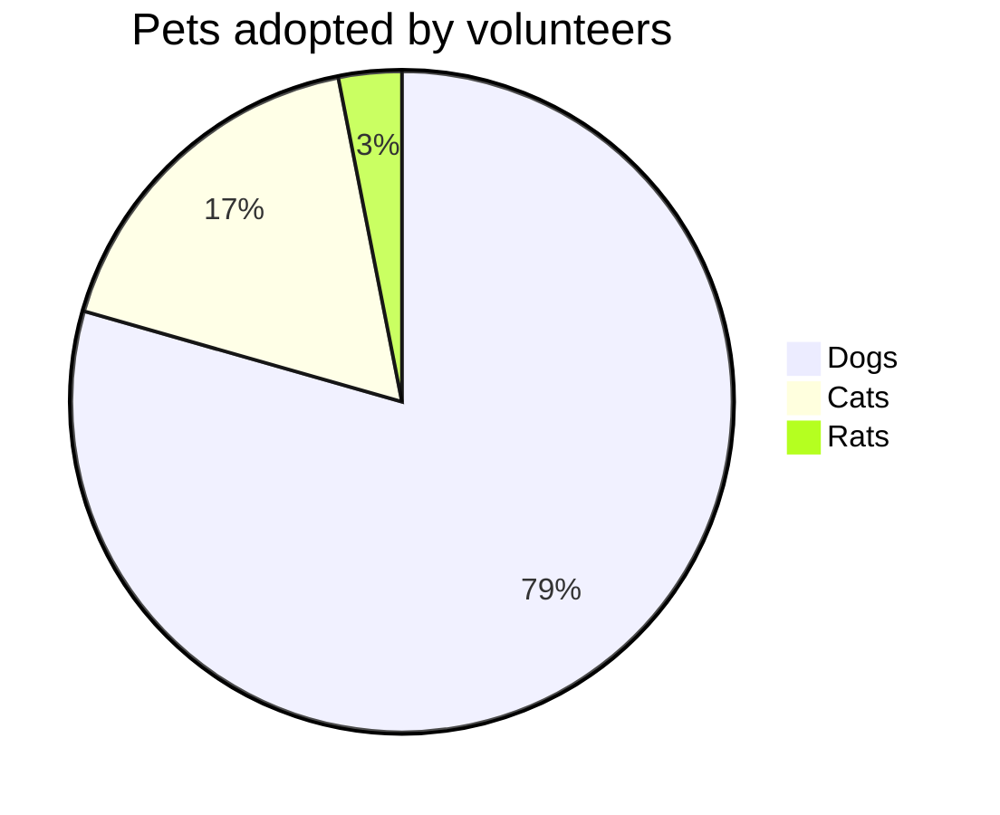
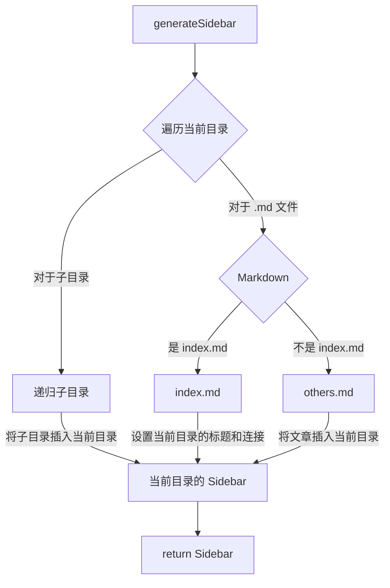

# 网站搭建

分享一下本网站的搭建流程与用到的技术等。

以后的网站功能更新等也会记录在这篇文章的 [功能扩展](#功能扩展) 部分中。

*本文不会细致入微的讲解每个细节，所以需要读者有一定基础。（如会用 github 创建仓库，拉取仓库到本地等）*

## 搭建

本网站基于 [Vitepress](https://vitepress.dev/) 构建。

> VitePress is a Static Site Generator (SSG) designed for building fast, content-centric websites. In a nutshell, VitePress takes your source content written in Markdown, applies a theme to it, and generates static HTML pages that can be easily deployed anywhere.

### 项目创建

1. 创建仓库

    首先打开 Github 随意创建一个空仓库，我选择的是使用 `<username>.github.io` 这个特殊仓库，当然使用其他仓库也没问题。

    需要注意的是，如果想用一个仓库就完成代码托管和部署，那这个仓库一定要是公开仓库，不能是私有仓库。*（可以使用一个私有仓库保存代码，一个公开仓库部署的方式，但我觉得没必要）*

2.  本地创建项目

    首先本地找个喜欢的目录，把仓库拉到本地：
   
    ```bash
    git clone REPOSITORY DIRNAME && cd DIRNAME # 替换大写变量！
    ```

    然后就是创建 Vitepress 项目的步骤了，可以参考 [官方文档](https://vitepress.dev/guide/getting-started)，下面简要带过一下：

    1. 安装 Vitepress：

        ```bash
        npm add -D vitepress
        ```

    2. 使用 setup wizard 初始化项目：

        ```bash
        npx vitepress init
        ```

        运行后会有一些配置，按自己喜欢的选择就好。

        ::: details *我的配置，仅供参考：*
        ```
        ┌  Welcome to VitePress!
        │
        ◇  Where should VitePress initialize the config?
        │  ./
        │
        ◇  Site title:
        │  My Awesome Project
        │
        ◇  Site description:
        │  A VitePress Site
        │
        ◇  Theme:
        │  Default Theme + Customization
        │
        ◇  Use TypeScript for config and theme files?
        │  Yes
        │
        ◇  Add VitePress npm scripts to package.json?
        │  Yes
        │
        └  Done! Now run npm run docs:dev and start writing.

        Tips:
        - Since you've chosen to customize the theme, you should also explicitly install vue as a dev dependency.
        ```
        :::

    3. 如果用自定义主题的话要单独安装 `vue`：

        ```bash
        npm install vue -D
        ```

    4. 安装到这里就完成啦！运行下面的命令就可以查看预览了。

        ```bash
        vitrepress dev
        # or
        npm run docs:dev # 需要上面配置时选择创建 npm scripts
        ```

3. 推送代码
   
    项目创建完后第一件事当然是提交 initial commit 啦：

    ```bash
    git add *
    git commit -m "initial commit"
    git push
    ```

    这样代码就推送到 Github 上了，下面我们将简单配置本项目，让这个网站看起来更舒服一些。

### 初步配置

- 添加 `.gitignore`
  
    ```
    .vitepress/dist
    .vitepress/cache
    node_modules/
    .vscode/
    ```

- 整理文件结构
  
    vitepress 的 [路由生成](https://vitepress.dev/guide/routing) 是遵守实际的文件结构的。

    > VitePress uses file-based routing, which means the generated HTML pages are mapped from the directory structure of the source Markdown files.

    将创建项目生成的两个样例文件 `api-examples.md` 和 `markdown-examples.md` 放到一个 `examples` 文件夹中（也可以直接删掉）。

    此外，再新建一个 `articles` 文件夹用于存放之后写的文章。

    `index.md` 就留在根目录就好。

- 配置 `.vitepress` 文件夹下的配置文件 `config.mts`：

    我的 [配置文件](https://github.com/hf-xz/hf-xz.github.io/blob/master/.vitepress/config.mts) 目前更新还比较频繁，所以请参照 [官方文档](https://vitepress.dev/reference/site-config#site-config) 自行查看。我会尽量在我的配置文件中写好注释。

## 部署

部署方面，代码存放在 Gihub。通过 `Github Page` 和 `Vercel` 两种方式进行部署。
最后在腾讯云购买域名解析到 Vercel 上解决国内访问的的问题。

### Github Page

首先，[官方文档](https://vitepress.dev/guide/deploy#github-pages)。

按文档的步骤，我们首先在 `.github/workflows` 文件夹下新建一个 `deploy.yml` 的文件，然后将下面的内容写入文件中：

*修改的地方是我的项目与官方文档不一样的地方，请自行辨别是否需要修改*

```yml
# Sample workflow for building and deploying a VitePress site to GitHub Pages
#
name: Deploy VitePress site to Pages

on:
  # Runs on pushes targeting the `main` branch. Change this to `master` if you're
  # using the `master` branch as the default branch.
  push:
    branches: [main] // [!code --]
    branches: [master] // [!code ++]

  # Allows you to run this workflow manually from the Actions tab
  workflow_dispatch:

# Sets permissions of the GITHUB_TOKEN to allow deployment to GitHub Pages
permissions:
  contents: read
  pages: write
  id-token: write

# Allow only one concurrent deployment, skipping runs queued between the run in-progress and latest queued.
# However, do NOT cancel in-progress runs as we want to allow these production deployments to complete.
concurrency:
  group: pages
  cancel-in-progress: false

jobs:
  # Build job
  build:
    runs-on: ubuntu-latest
    steps:
      - name: Checkout
        uses: actions/checkout@v3
        with:
          fetch-depth: 0 # Not needed if lastUpdated is not enabled
      # - uses: pnpm/action-setup@v2 # Uncomment this if you're using pnpm
      # - uses: oven-sh/setup-bun@v1 # Uncomment this if you're using Bun
      - name: Setup Node
        uses: actions/setup-node@v3
        with:
          node-version: 18
          cache: npm # or pnpm / yarn
      - name: Setup Pages
        uses: actions/configure-pages@v3
      - name: Install dependencies
        run: npm ci # or pnpm install / yarn install / bun install
      - name: Build with VitePress
        run: |
          npm run docs:build # or pnpm docs:build / yarn docs:build / bun run docs:build
          touch docs/.vitepress/dist/.nojekyll // [!code --]
          touch .vitepress/dist/.nojekyll // [!code ++]
      - name: Upload artifact
        uses: actions/upload-pages-artifact@v2
        with:
          path: docs/.vitepress/dist // [!code --]
          path: .vitepress/dist // [!code ++]

  # Deployment job
  deploy:
    environment:
      name: github-pages
      url: ${{ steps.deployment.outputs.page_url }}
    needs: build
    runs-on: ubuntu-latest
    name: Deploy
    steps:
      - name: Deploy to GitHub Pages
        id: deployment
        uses: actions/deploy-pages@v2
```

如果像我一样使用 `<username>.github.io` 这个仓库的话，此时如果保存项目并推送到 Github 的话会发现网站并没有像预期的使用 Vitepress 部署。这是因为 Github 为 `<username>.github.io` 这个仓库添加了一个默认的构建方法，这个方法使用 `jekyll` 来构建网站。

> If you want to use a build process other than Jekyll or you do not want a dedicated branch to hold your compiled static files, we recommend that you write a GitHub Actions workflow to publish your site.

参考 [官方指南](https://docs.github.com/en/pages/getting-started-with-github-pages/configuring-a-publishing-source-for-your-github-pages-site#publishing-with-a-custom-github-actions-workflow) 来修改项目配置。改好之后，推送代码到 Github，等构建部署完之后应该就可以访问 `https://<username>.github.io` 来查看构建好的网站了。

### Vercel

Vercel 的配置就相对简单了，都是图形化界面，参考 [官方文档](https://vitepress.dev/guide/deploy#netlify-vercel-cloudflare-pages-aws-amplify-render) 就好，注意如果像我一样项目在根目录而不在 `docs/` 文件夹下的话记得修改对应的路径。

### 域名

我们的两个部署方式虽然都是免费的，也提供了域名访问，但是由于国内的网络环境，两个部署方式提供的域名均无法在不使用魔法的情况下访问。

所幸访问不了的原因大都是 DNS 污染，也就是通过它提供的域名（`xxx.gihub.io` 和 `xxx.vercel.app`）无法解析到对应的 ip 地址，这种情况我们只需要自己购买一个域名然后解析到 Vercel 就好了。步骤如下：

1. 购买域名

    这个就不赘述了，大家去自己喜欢的地方买就好。

2. 域名解析

    买完的域名添加两条解析记录：

    | Type  | Name | Value                      |
    | :---- | :--- | :------------------------- |
    | A     | @    | 76.223.126.88              |
    | CNAME | www  | cname-china.vercel-dns.com |

    ::: tip 
    注意这里的 Value 和下一步中 Vercel 给出的 Value 不一样，因为我这里给出的是针对国内的 Value。 
    :::

3. 配置 Vercel

    打开 Vercel 项目，在上边标签栏中选择 `Settings`，然后从左边的选项中选择 `Domains`。在打开的页面中输入你购买并配置好的域名，点击 `Add` 按钮即可。

    如果成功的话，你应该在页面下面的列表中看到你添加的域名，并且这个域名中的条目都是打对勾的（说明配置正确）。

    接下来就只需要等待解析生效就可以了 *(Good news! Your DNS records are set up correctly, but it can take some time for them to propagate globally.)*。

### Clean Urls

如果不开启 Clean Urls 功能的话，每个 `article.md` 都会生成对应的 `path/to/article.html`，结尾有个 `.html` 就很烦😕。参考 [官方文档](https://vitepress.dev/guide/routing#generating-clean-url)，开启也很简单：

**Github**

Github 原本是不支持的（我配置本项目时 Vitepress 的官方文档还是这么写的）但是我发现只要在配置文件 `.vitepress/config.mts` 中配置 `cleanUrls: true` 就已经可以了（意思 Github 现在支持了） 。

**Vercel**

Vercel 除了要在 Vitepress 的配置文件里配置之外，还要在根目录创建一个 `vercel.json` 文件，里面写入以下内容：

```json
{
  ... // other config
  "cleanUrls": true
}
```

配置好了之后，现在每个 `article.md` 生成的路径就是 `path/to/article` 了，非常干爽👏。

## 使用指南

### 写文章

当所有东西都配置好了之后，写文章就是很轻松的事情了。

1. 在 `articles/` 下找个好地方存放文章
2. 写文章，可以用 Typora 等专业的 Markdown 软件
3. 保存并本地预览
4. 提交并推送到 Github
5. 等上一小会，新文章就可以在网页上访问啦！

当然，如果要新开一个文章分区什么的还是需要代码编辑器编辑一下代码的，当然这可以用 `github.dev` 在线编辑来实现，也是挺方便的。

### 新电脑迁移

跟所有 npm 项目一样，想在本地编辑本项目的话，就简单的 pull 代码到本地，然后运行 `npm install` 就可以了。注意 node 版本不要低于 16，建议 18。

## 功能扩展 

### Markdown 功能加强

Vitepress 已经为 Markdown 添加了许多功能扩展（如 emoji，代码高亮，代码组等）了，详见 [官方文档](https://vitepress.dev/guide/markdown)。

但还是有一些实用的功能并没有被支持，比如 taskLists：

```markdown
- [ ] todo
- [x] finished
```

所幸 Vitepress 使用 [markdown-it](https://github.com/markdown-it/markdown-it) 作为 Markdown 渲染引擎，所以所有 `markdown-it` 的插件我们都可以在 Vitepress 中使用，官方教程在 [这里](https://vitepress.dev/guide/markdown#advanced-configuration)。下面我会演示一下我是如何添加 taskList 支持的：

```typescript{7-12}
// .vitepress/config.mts
import taskLists from 'markdown-it-task-lists' // [!code ++]

let config = defineConfig({
  ..., // 其他配置

  markdown: {
    config: (md) => {
      // use more markdown-it plugins!
      md.use(taskLists)
    }
  },
}

export default config
```

添加完后，上述的例子将会被渲染这样：

- [ ] todo
- [x] finished

### Vitepress 集成 Giscus

### Vitepress 集成 Mermaid

使用现成插件 [vitepress-plugin-mermaid](https://emersonbottero.github.io/vitepress-plugin-mermaid/)。

首先安装插件：

```bash
npm i vitepress-plugin-mermaid mermaid -D
```

然后编辑配置文件：

```typescript{6-15}
import { withMermaid } from 'vitepress-plugin-mermaid' // [!code ++]

let config = defineConfig({
  ..., // 其他配置

  // optionally, you can pass MermaidConfig
  mermaid: {
    // refer for options:
    // https://mermaid.js.org/config/setup/modules/mermaidAPI.html#mermaidapi-configuration-defaults
  },
  // optionally set additional config for plugin itself with MermaidPluginConfig
  mermaidPlugin: {
    // set additional css class for mermaid container
    class: "mermaid"
  }
}

config = withMermaid(config) // [!code ++]

export default config
```

然后就可以像在 Typora 里写 mermaid 一样了。


````markdown

````


### COS 图床 + PicGo 上传

这个网站中的图片存储是个麻烦事。直接存到项目里的话，图片太多太乱而且 git 也不好管理。找个图床存的话，又总担心图床跑路。最后看了半天，还是决定掏点小钱去买个 COS 服务来存图片。

配置过程我也都参考的网上的资料，我就不再赘述一遍了，简单罗列几篇文章在下面：

- [知乎：使用 PicGo+腾讯云对象存储COS 作为图床](https://zhuanlan.zhihu.com/p/119250383)
- [PicGo 官网](https://picgo.github.io/PicGo-Doc/)
- [VSCode 版 PicGo](https://github.com/PicGo/vs-picgo)
- [Typora 上传图片](https://support.typora.io/Upload-Image/)

将 COS、PicGo 配置好之后就可以使用 COS 当图床，用 PicGo 来快捷上传了。可以根据平时写文章的软件再多配置一下 VSCode 和 Typora。

::: info
使用 PicGo 上传图片之后，如果在本地(markdown 中)又删除了这张图片，那么 COS 中的图片不会随之删除。
这会造成 COS 存储空间的浪费，并带来额外费用。*（很少很少）* 
:::

### 自动生成 Sidebar

有些文章集合需要一个 Sidebar 来当目录（比如 [50个前端练手项目](/articles/50projects50days/)）。

我通过一个 `generateSidebar` 函数来实现这个功能。原理图如下：



:::details 实现代码
```typescript
import { readdirSync, statSync } from 'fs'
import { join, parse } from 'path'
import matter from 'gray-matter'

import { DefaultTheme } from 'vitepress'
type SidebarItem = DefaultTheme.SidebarItem

function generateSidebar(dir: string) {
  // 初始化 SidebarItem
  let sidebar: SidebarItem = {
    base: `/${dir}/`,
    // text 初始值为目录名
    text: `${parse(dir).name}`,
    items: []
  }
  // 遍历目录
  let files = readdirSync(dir)
  let subDirs: string[] = []
  files.forEach((file) => {
    let path = join(dir, file)
    let stat = statSync(path)
    if (stat.isDirectory()) {
      // 稍后处理子文件夹
      subDirs.push(file)
    } else {
      // 处理 md 文件
      if (file.endsWith('.md')) {
        let { data } = matter.read(path)
        let { title } = data
        if (!title) {
          // frontmatter 中没有 title，就用文件名作为 title
          title = file.replace(/\.md$/, '')
        }
        if (file == 'index.md') {
          // 如果有 index 文件，就把它作为 Sidebar 的标题
          sidebar['text'] = title
          sidebar['link'] = file.replace(/\.md$/, '')
          return
        }
        // 一般不是 index 的文件，就作为 Sidebar 的子项
        let item: SidebarItem = {
          text: title,
          link: file.replace(/\.md$/, '')
        }
        sidebar.items!.push(item)
      }
    }
  })
  subDirs.forEach((subDir) => {
    let subSidebar = generateSidebar(join(dir, subDir))
    sidebar.items!.push(subSidebar)
  })
  return sidebar
}
```
:::
