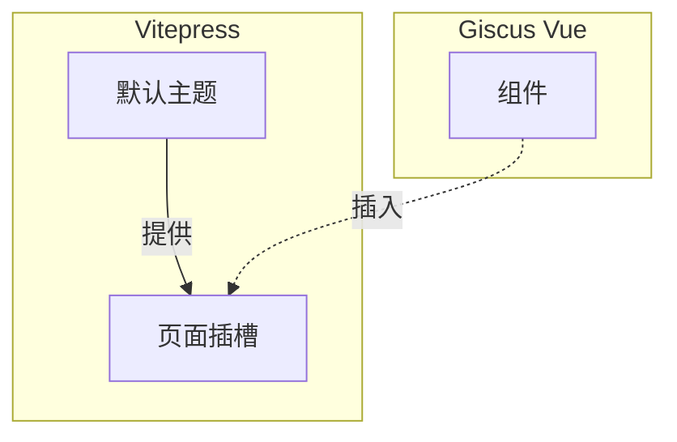
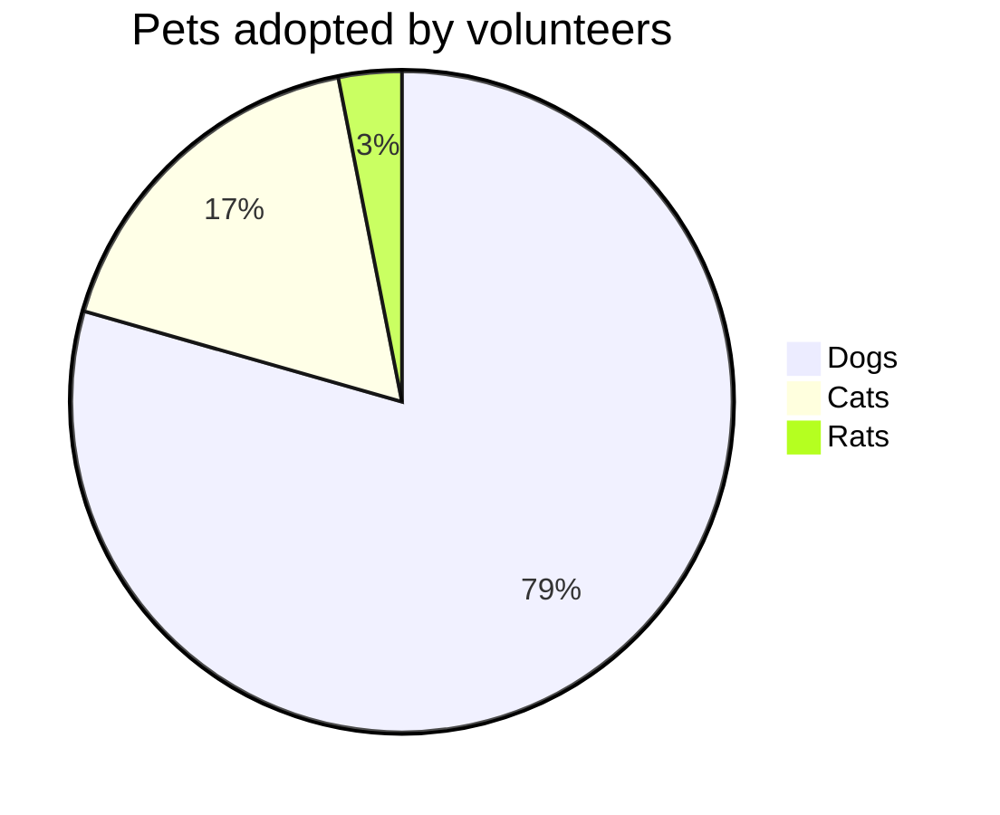
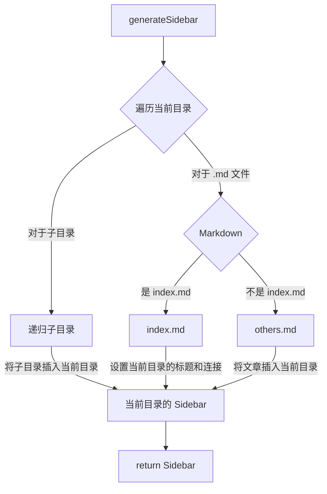

# 功能扩展 

## Markdown 功能加强

Vitepress 已经为 Markdown 添加了许多功能扩展（如 emoji，代码高亮，代码组等）了，详见 [官方文档](https://vitepress.dev/guide/markdown)。

但还是有一些实用的功能并没有被支持，比如 taskLists：

```markdown
- [ ] todo
- [x] finished
```

所幸 Vitepress 使用 [markdown-it](https://github.com/markdown-it/markdown-it) 作为 Markdown 渲染引擎，所以所有 `markdown-it` 的插件我们都可以在 Vitepress 中使用，官方教程在 [这里](https://vitepress.dev/guide/markdown#advanced-configuration)。下面我会演示一下我是如何添加 taskList 支持的：

```typescript{7-12}
// .vitepress/config.mts
import taskLists from 'markdown-it-task-lists' // [!code ++]

let config = defineConfig({
  ..., // 其他配置

  markdown: {
    config: (md) => {
      // use more markdown-it plugins!
      md.use(taskLists)
    }
  },
}

export default config
```

添加完后，上述的例子将会被渲染这样：

- [ ] todo
- [x] finished

## Vitepress 集成 Giscus

为了实现评论区的功能，我使用了 [Giscus](https://github.com/giscus/giscus)。

> A comments system powered by GitHub Discussions. Let visitors leave comments and reactions on your website via GitHub!

技术路线是这样的：



实现的过程中参考了如下几篇文章：

- [Giscus 使用指南](https://giscus.app/zh-CN)
- [Giscus 的 Vue Component](https://github.com/giscus/giscus-component)
- [Vitepress 默认主题插槽功能](https://vitepress.dev/guide/extending-default-theme#layout-slots)

大概流程如下：

1. 参考 **Giscus 使用指南** 配置仓库
2. 还是在 **Giscus 使用指南** 里，通过勾选选项生成一份配置，类似这个：

    *主要要看我高亮的这几行，下一步需要用到*

    ```html{2-8}
    <script src="https://giscus.app/client.js"
            data-repo="hf-xz/hf-xz.github.io"
            data-repo-id="R_kgDOKV8K4Q"
            data-category="giscus"
            data-category-id="DIC_kwDOKV8K4c4CZnx6"
            data-mapping="specific"
            data-term="123"
            data-strict="0"
            data-reactions-enabled="1"
            data-emit-metadata="0"
            data-input-position="top"
            data-theme="preferred_color_scheme"
            data-lang="zh-CN"
            data-loading="lazy"
            crossorigin="anonymous"
            async>
    </script>
    ```

3. 在 `.vitepress/theme` 目录下新建文件夹 `components`，然后创建一个 `MyGiscus.vue` 文件作为我们的评论区组件。参考 **Giscus 的 Vue Component** 编写我们的评论区（要把上面生成的配置改写为组件使用的形式）。

    :::warning
    实现时要注意，放在插槽中的组件在页面跳转时并不会自动更新（新页面还是原来的评论区），需要我们手动处理！
    :::

    这里给出我的代码作为参考。我的代码实现了 **跟随网页暗黑模式**、**监听页面跳转** 和 通过 `frontmatter` 设置 `comment: false` **在特定页面关闭评论区** 的功能。

    ```vue
    <!--.vitepress/theme/components/giscus.vue-->
    <script setup>
    import Giscus from '@giscus/vue'
    import { useData, useRoute } from 'vitepress'
    
    const { frontmatter, isDark } = useData()
    </script>
    
    <template>
      <div class="container">
        <Giscus
          class="giscus"
          v-if="frontmatter['comment'] !== false" // [!code hl]
          id="comments"
          repo="hf-xz/hf-xz.github.io"
          repoId="R_kgDOKV8K4Q"
          category="giscus"
          categoryId="DIC_kwDOKV8K4c4CZnx6"
          mapping="specific" // [!code hl]
          :term="useRoute().path" // [!code hl]
          strict="0"
          reactionsEnabled="1"
          emitMetadata="0"
          inputPosition="bottom"
          :theme="isDark ? 'noborder_dark' : 'noborder_light'" // [!code hl]
          lang="zh-CN"
          loading="lazy"
        />
      </div>
    </template>
    
    <style scoped>
    .container {
      margin-top: 2rem;
    }
    </style>
    ```

4. 参考 **Vitepress 默认主题插槽功能** 修改 `.vitepress/theme/index.ts`：

    ```typescript
    // https://vitepress.dev/guide/custom-theme
    import { h } from 'vue'
    import Theme from 'vitepress/theme'
    import './style.css'

    import MyGiscus from './components/MyGiscus.vue' // [!code focus]

    export default {
      extends: Theme,
      Layout: () => {
        return h(Theme.Layout, null, {
        // https://vitepress.dev/guide/extending-default-theme#layout-slots
          'doc-after': () => h(MyGiscus) // [!code focus]
        })
      },
      enhanceApp({ app, router, siteData }) {
        // ...
      }
    }
    ```

    :::tip
    这里我将组件放在了 `doc-after` 插槽，这是一个 `layout: doc（默认值）` 页面的专属插槽，所以在首页这种 `layout: home` 的页面就不会显示。在其他 `doc` 页面想关闭评论区只需要在 `frontmatter` 里添加 `comment: false` 即可。
    :::

    :::tip
    这里在 ts 文件中 import 一个 vue 文件会报错，因为他们互不认识。

    请新建如下两个文件：

    `.vitepress/vue.d.ts`: 

    ```typescript
    declare module '*.vue' {
      import { ComponentOptions } from 'vue'
      const componentOptions: ComponentOptions
      export default componentOptions
    }
    ```

    `.vitepress/tsconfig.json`:

    ```json
    {
      "include": [
        "vue.d.ts",
        "**/*.ts",
      ]
    }
    ```

    *我对这两个文件理解还不深，写的可能有问题，但这样确实解决了我的报错问题，如果有更好的写法请在评论区给我留言。*
    :::

## Vitepress 集成 Mermaid

使用现成插件 [vitepress-plugin-mermaid](https://emersonbottero.github.io/vitepress-plugin-mermaid/)。

首先安装插件：

```bash
npm i vitepress-plugin-mermaid mermaid -D
```

然后编辑配置文件：

```typescript{6-15}
import { withMermaid } from 'vitepress-plugin-mermaid' // [!code ++]

let config = defineConfig({
  ..., // 其他配置

  // optionally, you can pass MermaidConfig
  mermaid: {
    // refer for options:
    // https://mermaid.js.org/config/setup/modules/mermaidAPI.html#mermaidapi-configuration-defaults
  },
  // optionally set additional config for plugin itself with MermaidPluginConfig
  mermaidPlugin: {
    // set additional css class for mermaid container
    class: "mermaid"
  }
}

config = withMermaid(config) // [!code ++]

export default config
```

然后就可以像在 Typora 里写 mermaid 一样了。


````markdown

````


## COS 图床 + PicGo 上传

这个网站中的图片存储是个麻烦事。直接存到项目里的话，图片太多太乱而且 git 也不好管理。找个图床存的话，又总担心图床跑路。最后看了半天，还是决定掏点小钱去买个 COS 服务来存图片。

配置过程我也都参考的网上的资料，我就不再赘述一遍了，简单罗列几篇文章在下面：

- [知乎：使用 PicGo+腾讯云对象存储COS 作为图床](https://zhuanlan.zhihu.com/p/119250383)
- [PicGo 官网](https://picgo.github.io/PicGo-Doc/)
- [VSCode 版 PicGo](https://github.com/PicGo/vs-picgo)
- [Typora 上传图片](https://support.typora.io/Upload-Image/)

将 COS、PicGo 配置好之后就可以使用 COS 当图床，用 PicGo 来快捷上传了。可以根据平时写文章的软件再多配置一下 VSCode 和 Typora。

::: info
使用 PicGo 上传图片之后，如果在本地(markdown 中)又删除了这张图片，那么 COS 中的图片不会随之删除。
这会造成 COS 存储空间的浪费，并带来额外费用。*（很少很少）* 
:::

## 自动生成 Sidebar

有些文章集合需要一个 Sidebar 来当目录，我通过一个 `generateSidebar` 函数来实现这个功能。原理图如下：



:::details 实现代码
```typescript
import { readdirSync, statSync } from 'fs'
import { join, parse } from 'path'
import matter from 'gray-matter'

import { DefaultTheme } from 'vitepress'
type SidebarItem = DefaultTheme.SidebarItem

function generateSidebar(dir: string) {
  // 初始化 SidebarItem
  let sidebar: SidebarItem = {
    base: `/${dir}/`,
    // text 初始值为目录名
    text: `${parse(dir).name}`,
    items: []
  }
  // 遍历目录
  let files = readdirSync(dir)
  let subDirs: string[] = []
  files.forEach((file) => {
    let path = join(dir, file)
    let stat = statSync(path)
    if (stat.isDirectory()) {
      // 稍后处理子文件夹
      subDirs.push(file)
    } else {
      // 处理 md 文件
      if (file.endsWith('.md')) {
        let { data } = matter.read(path)
        let { title } = data
        if (!title) {
          // frontmatter 中没有 title，就用文件名作为 title
          title = file.replace(/\.md$/, '')
        }
        if (file == 'index.md') {
          // 如果有 index 文件，就把它作为 Sidebar 的标题
          sidebar['text'] = title
          sidebar['link'] = file.replace(/\.md$/, '')
          return
        }
        // 一般不是 index 的文件，就作为 Sidebar 的子项
        let item: SidebarItem = {
          text: title,
          link: file.replace(/\.md$/, '')
        }
        sidebar.items!.push(item)
      }
    }
  })
  subDirs.forEach((subDir) => {
    let subSidebar = generateSidebar(join(dir, subDir))
    sidebar.items!.push(subSidebar)
  })
  return sidebar
}
```
:::

使用：

:::code-group
```typescript [sidebar.ts]
// My separate sidebar file.
let sidebar = {
  '/examples/': [
    {
      base: '/examples/',
      text: 'Examples',
      items: [
        { text: 'Markdown Examples', link: 'markdown-examples' },
        { text: 'Runtime API Examples', link: 'api-examples' }
      ]
    }
  ],
  '/articles/50projects50days/': [ generateSidebar('articles/50projects50days') ],
  '/articles/initial/': [ generateSidebar('articles/initial') ], // [!code focus]
}

export default sidebar
```

```[file structure]
initial
├── 1-build.md
├── 2-deploy.md
├── 3-guide.md
├── 4-enhance.md
└── index.md
```
:::

最终效果就像在本页面看到的一样，Sidebar 会作为几篇文章的一个目录，如果在某一级目录下有 `index.md` 那么这个这一级目录的标题将可以点击并跳转到这个 `index.md`。
